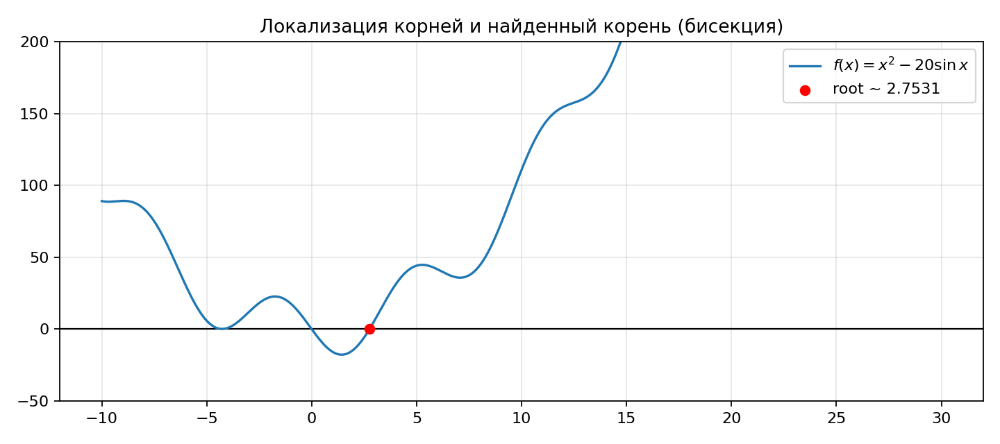
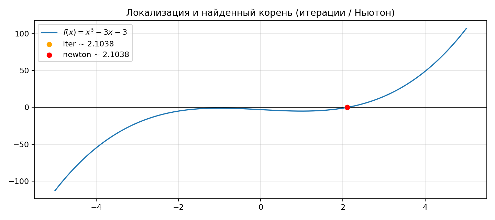

# Отчёт по домашнему заданию №2 — методы численного решения нелинейных уравнений
**Вариант 7**  
**Точность:** $\varepsilon = 0.001$

---

## 1. Краткое описание реализуемых методов, условие сходимости, критерий окончания алгоритма

### 1.1. Метод половинного деления (бисекции)
**Назначение:** найти корень уравнения $f(x)=0$ на отрезке локализации $[a,b]$.

**Требование для старта:** $f$ непрерывна на $[a,b]$ и выполнено условие смены знака:
$$f(a)\cdot f(b)\le 0.$$

**Шаг:** $m=\dfrac{a+b}{2}$. Далее выбираем новый отрезок $[a,m]$ или $[m,b]$, где сохраняется смена знака.

**Критерий окончания:**  
$$\frac{b-a}{2}\le \varepsilon.$$

### 1.2. Метод простой итерации
**Идея:** приводим уравнение к виду
$$x=\varphi(x),$$
и строим последовательность
$$x_{k+1}=\varphi(x_k).$$

**Достаточное условие сходимости:** на отрезке $[a,b]$
$$q=\max_{x\in[a,b]}|\varphi'(x)|<1.$$

**Критерий окончания:**  
$$|x_{k+1}-x_k|\le \varepsilon.$$

### 1.3. Метод Ньютона
$$x_{k+1}=x_k-\frac{f(x_k)}{f'(x_k)}.$$

**Критерий окончания:**  
$$|x_{k+1}-x_k|\le \varepsilon.$$

**Замечание:** при хорошем начальном приближении обычно сходится быстро (часто квадратично).

---

## 2. Постановка задачи и исходные данные

По `variant.png` (вариант 7):

### 2.1. Пункт 1
Отделить корни уравнения и найти корень методом бисекции с точностью $\varepsilon=0.001$:
$$f_1(x)=x^2-20\sin x = 0.$$

### 2.2. Пункт 2
Отделить корни уравнения и найти корень методом простой итерации и методом Ньютона с точностью $\varepsilon=0.001$:
$$f_2(x)=x^3-3x-3=0.$$

---

## 3. График с локализованным корнем (графический калькулятор)

### 3.1. Пункт 1


### 3.2. Пункт 2


---

## 4. Запись расчетных формул (для метода простой итерации и метода Ньютона)

### 4.1. Простая итерация (пункт 2)
Выбираем эквивалентное преобразование:
$$x^3-3x-3=0 \Rightarrow x=\sqrt[3]{3x+3}.$$
Тогда:
$$\varphi(x)=(3x+3)^{1/3},\qquad x_{k+1}=\varphi(x_k).$$
Производная для проверки условия сходимости:
$$\varphi'(x)=\frac{1}{(3x+3)^{2/3}}.$$

### 4.2. Метод Ньютона (пункт 2)
$$f(x)=x^3-3x-3,\qquad f'(x)=3x^2-3,$$
$$x_{k+1}=x_k-\frac{x_k^3-3x_k-3}{3x_k^2-3}.$$

---

## 5. Текст программы

Файлы:
- `nonlinear_methods.py` — реализации методов (локализация по смене знака, бисекция, итерации, Ньютон)
- `p1_bisection.py` — решение пункта 1 + построение графика
- `p2_iteration_newton.py` — решение пункта 2 + построение графика

Ключевые фрагменты кода.

### 5.1. Бисекция
```python
def bisection(f, a, b, *, eps, max_iter=10_000):
    fa, fb = f(a), f(b)
    if fa * fb > 0:
        raise ValueError("Need sign change on [a,b]")
    left, right = a, b
    for _ in range(max_iter):
        mid = 0.5 * (left + right)
        fmid = f(mid)
        if 0.5 * (right - left) <= eps:
            return mid
        if fa * fmid < 0:
            right, fb = mid, fmid
        else:
            left, fa = mid, fmid
    return 0.5 * (left + right)
```

### 5.2. Ньютон
```python
def newton(f, df, x0, *, eps, max_iter=100_000):
    x = x0
    for _ in range(max_iter):
        x_next = x - f(x) / df(x)
        if abs(x_next - x) <= eps:
            return x_next
        x = x_next
    return x
```

---

## 6. Результаты расчетов

### 6.1. Пункт 1 — бисекция для $x^2-20\sin x=0$

**Локализация (по графику и смене знака на $[-10,30]$):**
- $x=0$ — корень,
- $[2.750000,\,2.755000]$ — корень.

Для расчёта выбран интервал $[2.75,\,2.755]$.

**Результат (ε=0.001):**
- $x^*\approx 2.753125$
- число итераций: 3
- $|f_1(x^*)|\approx 4.284\cdot 10^{-3}$

### 6.2. Пункт 2 — простая итерация и Ньютон для $x^3-3x-3=0$

**Локализация (на $[-5,5]$):** $[2.102500,\,2.105000]$, старт $x_0=2.103750$.

| Метод | $x^*$ | итераций | $|f(x^*)|$ |
|---|---:|---:|---:|
| Простая итерация | 2.1037913369 | 1 | 1.240e-04 |
| Ньютон | 2.1038034045 | 1 | 1.800e-08 |

---

## 7. Анализ полученных результатов (оценка скорости сходимости)

- **Бисекция**: сходимость гарантирована, но скорость линейная; точность определяется длиной отрезка.
- **Простая итерация**: скорость зависит от $q=\max|\varphi'|$ (чем меньше $q$, тем быстрее).
- **Ньютон**: обычно самый быстрый при удачном старте; в этой задаче уже за 1 шаг выполнен критерий $|x_{k+1}-x_k|\le\varepsilon$, а невязка получилась очень маленькой.

