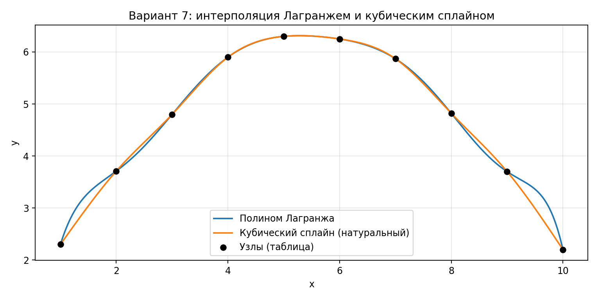

# Отчёт по домашнему заданию №3 — аппроксимация функций (интерполяция)
**Вариант 7**

---

## 1. Краткое описание реализуемых методов

### 1.1. Интерполяционный полином Лагранжа
Строит единственный полином степени не выше $n-1$, проходящий через заданные узлы $(x_i,y_i)$:
$$L(x_i)=y_i,\quad i=1..n.$$
В вычислениях удобно использовать барицентрическую форму (устойчивее, чем явное перемножение базисов).

### 1.2. Кубический сплайн (натуральный)
Кусочно-кубическая функция $S(x)$ на каждом интервале $[x_i,x_{i+1}]$:
- $S(x_i)=y_i$,
- $S,S',S''$ непрерывны,
- натуральные условия: $S''(x_1)=0$, $S''(x_n)=0$.

---

## 2. Постановка задачи и исходные данные

По `variant.png` (табличная функция):

| i | 1 | 2 | 3 | 4 | 5 | 6 | 7 | 8 | 9 | 10 |
|---:|---:|---:|---:|---:|---:|---:|---:|---:|---:|---:|
| $x_i$ | 1 | 2 | 3 | 4 | 5 | 6 | 7 | 8 | 9 | 10 |
| $y_i$ | 2.30 | 3.71 | 4.80 | 5.90 | 6.30 | 6.25 | 5.87 | 4.82 | 3.70 | 2.20 |

Требуется построить $L(x)$ и $S(x)$, построить графики на сетке и сравнить значения в точках, не совпадающих с узлами.

---

## 3. Запись расчетных формул для полиномов заданных функций

### 3.1. Полином Лагранжа
$$
L(x)=\sum_{i=1}^{n} y_i\,\ell_i(x),
$$
где базисные полиномы:
$$
\ell_i(x)=\prod_{\substack{j=1\\j\ne i}}^{n}\frac{x-x_j}{x_i-x_j}.
$$

### 3.2. Кубический сплайн
На каждом интервале $[x_i,x_{i+1}]$:
$$
S_i(x)=a_i + b_i(x-x_i) + c_i(x-x_i)^2 + d_i(x-x_i)^3.
$$
Коэффициенты $a_i,b_i,c_i,d_i$ находятся из условий интерполяции, гладкости и натуральных граничных условий.

---

## 4. Текст программы

Файлы:
- `interp_methods.py` — Лагранж (барицентрически) и натуральный кубический сплайн
- `p1_lagrange_spline.py` — построение графика и сравнение в межузловых точках

Ключевой фрагмент (вычисление значений Лагранжа барицентрически):
```python
def lagrange_barycentric_eval(x_nodes, y_nodes, x_eval):
    w = barycentric_weights(x_nodes)
    out = []
    for x in x_eval:
        if x in x_nodes:
            out.append(y_nodes[x_nodes == x][0])
            continue
        num = sum((w * y_nodes) / (x - x_nodes))
        den = sum(w / (x - x_nodes))
        out.append(num / den)
    return np.array(out)
```

---

## 5. Графики полученных полиномов на заданной сетке

Общий график (полином Лагранжа, кубический сплайн, узлы):



---

## 6. Сравнение значений кубического сплайна и заданной функции в точках, не совпадающих с узлами интерполяции

Так как исходная функция задана **таблично**, её “истинные” значения между узлами не определены.
Поэтому для сравнения в межузловых точках берём интерполяционное представление табличной функции полиномом Лагранжа $L(x)$
и сравниваем со сплайном $S(x)$ в выбранных точках $x_{mid,i}=\dfrac{x_i+x_{i+1}}{2}$.

| x | L(x) | S(x) | abs(S−L) |
|---:|---:|---:|---:|
| 1.50 | 3.290554 | 3.041680 | 2.489e-01 |
| 2.50 | 4.186518 | 4.264959 | 7.844e-02 |
| 3.50 | 5.418053 | 5.389733 | 2.832e-02 |
| 4.50 | 6.185853 | 6.189859 | 4.006e-03 |
| 5.50 | 6.306041 | 6.307080 | 1.039e-03 |
| 6.50 | 6.123841 | 6.134320 | 1.048e-02 |
| 7.50 | 5.430376 | 5.390640 | 3.974e-02 |
| 8.50 | 4.176340 | 4.280621 | 1.043e-01 |
| 9.50 | 3.361294 | 2.990626 | 3.707e-01 |

