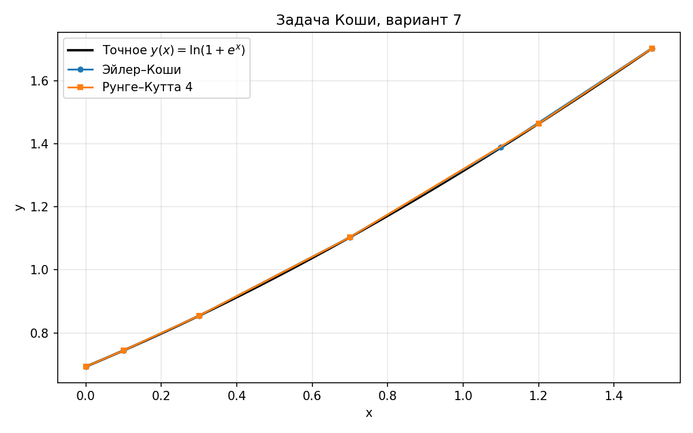

# Отчёт по домашнему заданию №5 — численное решение задачи Коши
**Вариант 7**  
**Точность:** $\varepsilon = 0.001$  
**Начальный шаг:** $h_0 = 0.1$

---

## 1. Краткое описание реализуемых методов

### 1.1. Метод Эйлера–Коши (модифицированный Эйлер)
Для $y'=f(x,y)$ на шаге $h$:
$$\tilde y_{k+1}=y_k+h f(x_k,y_k),$$
$$y_{k+1}=y_k+\frac{h}{2}\bigl(f(x_k,y_k)+f(x_{k+1},\tilde y_{k+1})\bigr).$$
Локальная погрешность $O(h^3)$, глобальная $O(h^2)$.

### 1.2. Метод Рунге–Кутта 4-го порядка (RK4)
$$k_1=f(x_k,y_k),\quad k_2=f\!\left(x_k+\tfrac h2,y_k+\tfrac h2 k_1\right),$$
$$k_3=f\!\left(x_k+\tfrac h2,y_k+\tfrac h2 k_2\right),\quad k_4=f(x_k+h,y_k+h k_3),$$
$$y_{k+1}=y_k+\frac{h}{6}(k_1+2k_2+2k_3+k_4).$$
Глобальная погрешность $O(h^4)$.

### 1.3. Автоматический выбор шага по правилу Рунге
На каждом шаге сравниваются решения с шагом $h$ и $h/2$:
- для Эйлера–Коши: $\dfrac{|y_h-y_{h/2}|}{3}\le \varepsilon$;
- для RK4: $\dfrac{|y_h-y_{h/2}|}{15}\le \varepsilon$.

Если условие не выполнено, шаг уменьшается; при малой оценке погрешности шаг увеличивается.

---

## 2. Постановка задачи и исходные данные

По таблице вариантов (вариант 7):

$$y'=f(x,y)=e^{x-y},\qquad x\in[0;1.5],\qquad y(0)=\ln 2.$$

Точное решение:
$$y(x)=\ln(1+e^x).$$

Проверка:
$$y(0)=\ln 2,\qquad y'(x)=\frac{e^x}{1+e^x}=e^{x-y(x)}.$$

---

## 3. Текст программы

Файлы:
- `ode_methods.py` — Эйлер–Коши, RK4, адаптивный шаг по Рунге
- `p1_cauchy_rk4.py` — расчёт, сравнение и построение графика

Ключевой фрагмент (один шаг RK4):
```python
def rk4_step(f, x, y, h):
    k1 = f(x, y)
    k2 = f(x + 0.5*h, y + 0.5*h*k1)
    k3 = f(x + 0.5*h, y + 0.5*h*k2)
    k4 = f(x + h, y + h*k3)
    return y + h/6.0 * (k1 + 2*k2 + 2*k3 + k4)
```

---

## 4. Сравнение числа вычисленных значений искомой функции

На промежутке $[0;1.5]$ с автоматическим выбором шага ($h_0=0.1$):

| Метод | Число шагов | Число вычисленных точек $(x_i,y_i)$ |
|---|---:|---:|
| Эйлер–Коши | 5 | 6 |
| Рунге–Кутта 4 | 5 | 6 |

Оба метода прошли интервал с одинаковым числом принятых шагов, но RK4 обеспечивает существенно меньшую погрешность при том же числе точек.

---

## 5. Сравнение последнего приближённого значения с точным $y(x)$

Точное значение в конце интервала:
$$y(1.5)=\ln(1+e^{1.5})\approx 1.70141328.$$

| Метод | $y(1.5)$ (численно) | abs($y-y_{\text{exact}}$) |
|---|---:|---:|
| Эйлер–Коши | 1.70244636 | $1.03\cdot10^{-3}$ |
| Рунге–Кутта 4 | 1.70141525 | $1.98\cdot10^{-6}$ |

**Вывод:** оба метода удовлетворяют $\varepsilon=0.001$. RK4 даёт погрешность на 3 порядка меньше при том же числе шагов.

---

## 6. Графики точного решения и численных методов



На графике:
- чёрная линия — точное решение $y(x)=\ln(1+e^x)$;
- маркеры — значения, полученные методами Эйлера–Коши и RK4 на адаптивной сетке.

Визуально все три кривые практически совпадают; наибольшее расхождение у метода Эйлера–Коши заметно лишь при увеличении масштаба.
